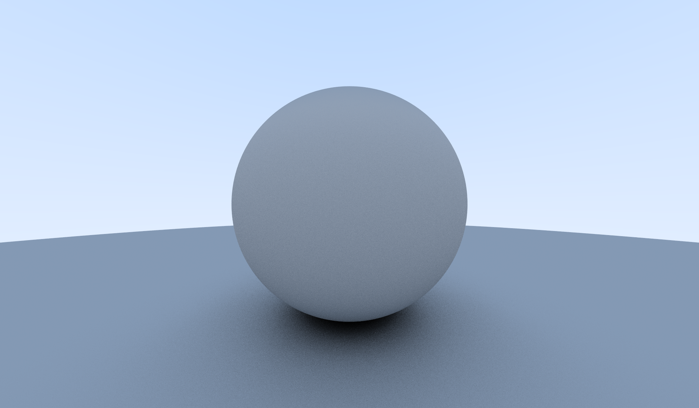

# Ray-tracer
A ray-tracing program built using OpenGL and compute shaders for real-time ray casting system.

### Demo of the program

### Rendering of completed scene

### Build and Installation
1. create and switch to "build" directory
2. cmake ..
3. make
4. ./OpenGLApp

# Example Materials
### Diffused Sphere

### Metalic Spheres

### Dielectric Sphere

